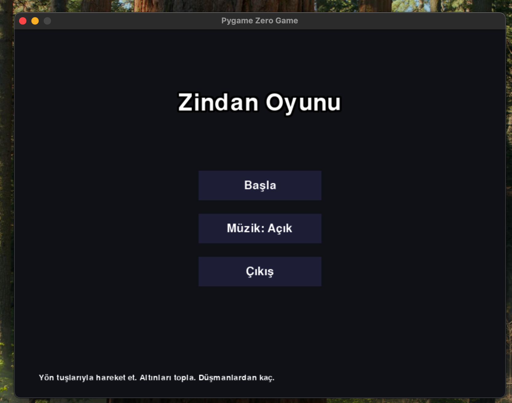
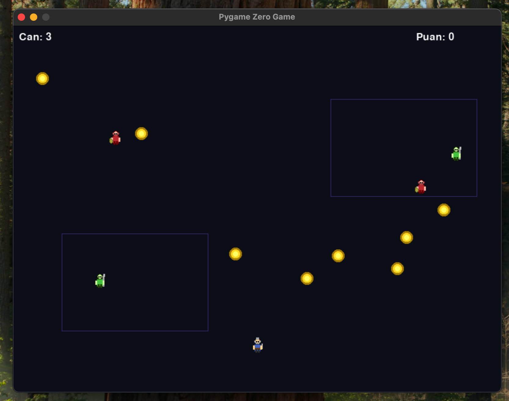
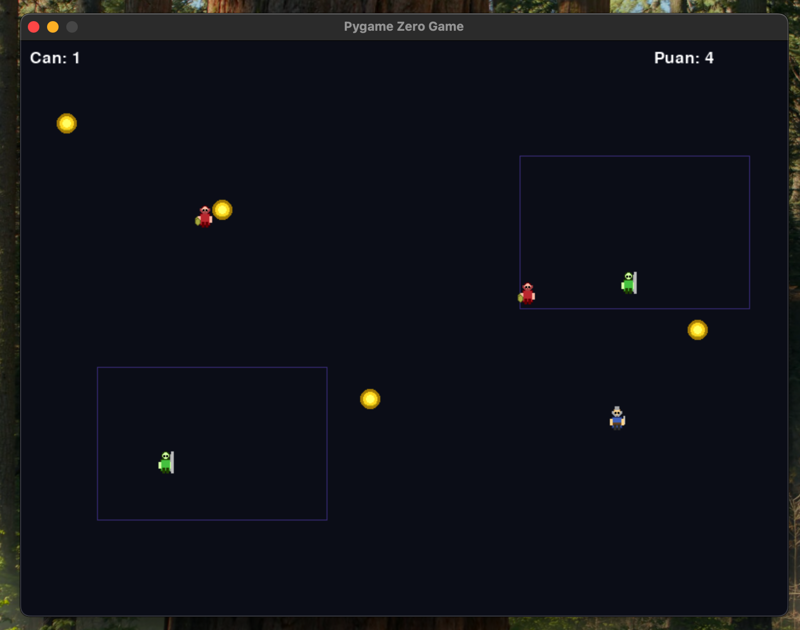

## Oyun İçi Ekran Görüntüleri

Aşağıda oyunun farklı anlarından alınmış bazı ekran görüntüleri yer almaktadır:

<p align="center">
	
	
</p>

<p align="center">
	
</p>

# Dungeon Dash


Basit ve eğlenceli bir Pygame Zero platform oyunu. Oyuncu altınları toplar, düşmanlardan kaçar. Menü, oyun, kazanma ve kaybetme ekranları içerir.

## Özellikler

- Yön tuşları ile karakter kontrolü
- Altın toplama ve puan sistemi
- Farklı düşman tipleri (devriye ve gezgin)
- Müzik ve ses efektleri
- Modern ve kullanıcı dostu arayüz

## Gereksinimler

- Python 3.7 veya üzeri
- [Pygame Zero](https://pygame-zero.readthedocs.io/en/stable/)
- pygame

## Kurulum

```bash
pip install -r requirements.txt
```

## Kullanım

```bash
pgzrun game.py
```

## Klasör Yapısı

```
python_game/
├── game.py              # Ana oyun dosyası
├── images/              # Oyun görselleri (sprite'lar)
├── sounds/              # Ses efektleri
├── music/               # Arka plan müziği
├── requirements.txt     # Bağımlılıklar
└── README.md            # Proje açıklaması
```

## Klasör Yapısı

```
python_game/
├── game.py              # Ana oyun dosyası
├── images/              # Oyun içi görseller (sprite'lar)
│   ├── player_idle_0.png
│   ├── player_idle_1.png
│   ├── player_walk_0.png
│   ├── player_walk_1.png
│   ├── enemy_patrol_idle_0.png
│   ├── enemy_patrol_walk_0.png
│   ├── enemy_wander_idle_0.png
│   ├── enemy_wander_walk_0.png
│   └── coin.png
├── sounds/              # Ses efektleri
├── music/               # Arka plan müziği
├── requirements.txt     # Bağımlılıklar
└── README.md            # Proje açıklaması
```

### `images/` Klasörü Hakkında

Oyun içi tüm sprite ve görseller bu klasörde yer alır:

- `player_idle_0.png`, `player_idle_1.png`: Oyuncunun durma animasyonu
- `player_walk_0.png`, `player_walk_1.png`: Oyuncunun yürüme animasyonu
- `enemy_patrol_idle_0.png`, `enemy_patrol_walk_0.png`: Devriye düşman animasyonları
- `enemy_wander_idle_0.png`, `enemy_wander_walk_0.png`: Gezgin düşman animasyonları
- `coin.png`: Toplanabilir altın

Görsellerin boyutu genellikle 30x30 pikseldir ve şeffaf arka plana sahiptir. Kendi sprite'larınızı ekleyerek karakter veya düşman görünümlerini özelleştirebilirsiniz.

## Katkı

Katkıda bulunmak isterseniz, lütfen bir fork oluşturun ve pull request gönderin.

## Lisans

MIT License
